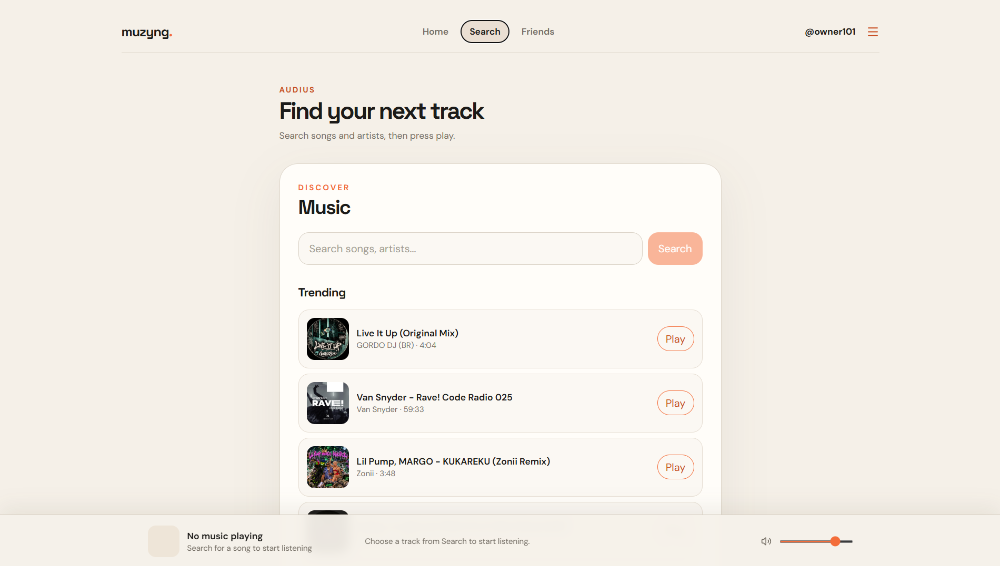
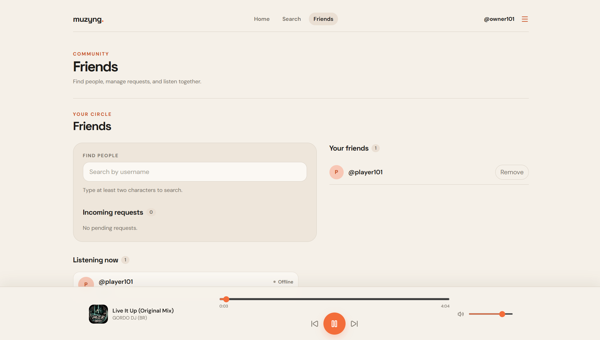
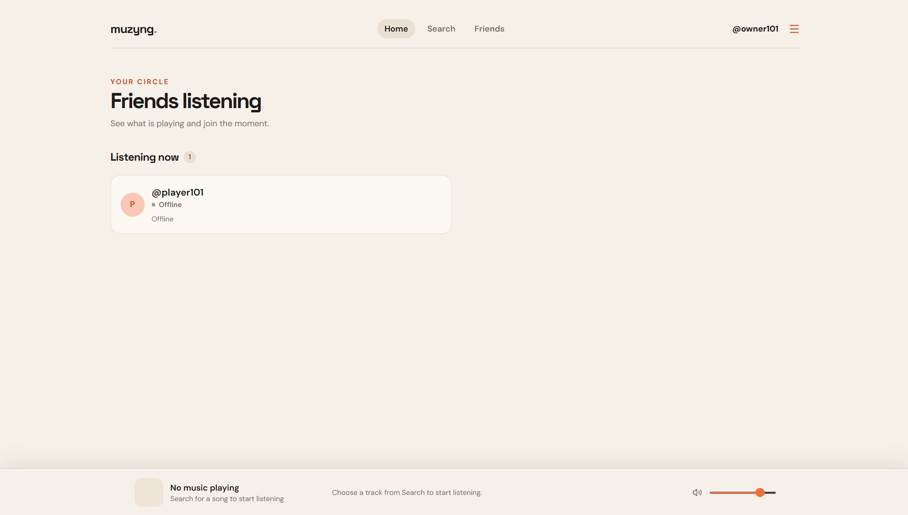

# 🎵 Musyko

**Musyko is a social music-listening web app that turns music discovery into a shared experience. Discover music, see what your friends are listening to, and join their listening session in real time.**

**🌐 Live App:** [https://muzyng.vercel.app/](https://muzyng.vercel.app/)

[](https://nextjs.org/)
[](https://www.typescriptlang.org/)
[](https://supabase.com/)
[](https://vercel.com/)

Musyko is built around a simple idea: music is better when it gives people a reason to connect. The product combines discovery, playback, friendship, and live listening presence in one focused experience.

---

## 📸 Product Preview

### Explore music

Search songs and artists through Audius, browse trending tracks, and start listening from the discovery experience.



### See your circle

Manage friendships and see which friends are online or currently listening.



### A focused listening home

The home experience brings the social listening activity of your circle into view.


### Your signed-in experience

Authenticated users get a personalized home with their profile context and live friend activity.



---

## ✨ What is Musyko?

Musyko is a social layer for music discovery. Instead of listening in isolation, you can discover a track, build your circle, see what friends have on, and join them at the moment they are hearing it.

The experience is designed to make the space between “What should I listen to?” and “Listen to this with me” feel immediate.

## 🎧 What You Can Do

- 🎵 Discover and search music through Audius
- ▶️ Play music with a persistent player
- 🔎 Search and explore tracks by song or artist
- 👥 Find people and add friends by username
- 🤝 Send, accept, reject, and remove friend requests
- 🟢 See what friends are currently listening to
- 🎧 Join a friend’s current listening session
- ⏱️ Join at the friend’s current playback position
- 🔄 Receive real-time listening presence updates
- 🔐 Create an account and sign in with email and password
- 👤 Use a unique username and user profile
- 🔑 Use the forgot-password and reset-password flows
- 📱 Use the responsive interface across screen sizes

## 🎶 How Musyko Works

### Discover → Add Friends → See What They’re Listening To → Join → Listen Together

1. **Discover:** Browse trending music or search the Audius catalog.
2. **Add friends:** Find people by username and manage your friend requests.
3. **See the moment:** View a friend’s online status, track, artwork, and playback state.
4. **Join:** Start the same track at the current playback position.
5. **Listen together:** Supabase Realtime keeps listening presence in sync as the session changes.

Musyko uses **Audius** for music discovery and streaming, and **Supabase** for authentication, profiles, friendships, presence, and real-time synchronization.

## 🛠️ Built With

| Technology | Role in Musyko |
| --- | --- |
| **Next.js** | Full-stack React application, pages, layouts, and server routes |
| **React** | Interactive discovery, authentication, friendships, and player experiences |
| **TypeScript** | Typed application and integration code |
| **Tailwind CSS** | Responsive product interface and visual styling |
| **Supabase** | Email/password auth, PostgreSQL data, row-level security, and Realtime |
| **Audius API** | Trending tracks, search results, track metadata, and audio streams |
| **Native HTML5 Audio** | Persistent playback, seeking, volume, and playback state |
| **Vercel** | Production deployment for the live application |

## 🧠 Product Architecture

Musyko is a Next.js application with a client-side experience coordinated by a persistent music player. The app uses server routes to retrieve and normalize Audius track data before handing stream URLs to the native HTML5 Audio element.

- **Next.js application/frontend:** Renders the product, handles navigation, and exposes the Audius routes used by the interface.
- **Supabase Auth:** Manages email/password accounts, sessions, and password recovery.
- **Supabase PostgreSQL:** Stores profiles, usernames, friendships, and listening presence with row-level security policies.
- **Supabase Realtime:** Publishes listening-presence changes to accepted friends as they play, pause, or move through a track.
- **Audius API:** Supplies searchable and trending music plus streamable track data.
- **Native HTML5 audio player:** Keeps playback controls, progress, volume, and the active track available throughout the app.
- **Vercel:** Hosts the production Musyko deployment.

When a listener plays or joins a track, Musyko writes the current track, playback state, and position to listening presence. Friends receive those updates through Supabase Realtime; joining calculates the current position and loads the same Audius stream in the friend’s player.

## 🚀 Live Product

### [Open Musyko →](https://muzyng.vercel.app/)

The live deployment is the primary product demonstration. Open it to explore music, create an account, add friends, and experience real-time listening activity.

---

## 💻 Local Development

To run Musyko locally:

```bash
npm install
npm run dev
```

Then open `http://localhost:3000`.

## 🔐 Environment Variables

Create a `.env.local` file with the two required Supabase values:

```env
NEXT_PUBLIC_SUPABASE_URL=
NEXT_PUBLIC_SUPABASE_PUBLISHABLE_KEY=
```

These optional values override the built-in Audius defaults and configure auth redirect URLs:

```env
AUDIUS_API_BASE_URL=https://api.audius.co/v1
AUDIUS_APP_NAME=muzyng
NEXT_PUBLIC_SITE_URL=https://muzyng.vercel.app
```

Never expose a Supabase service-role key or other private credentials in client-side environment variables.

## 🗄️ Supabase

The SQL migrations in `supabase/migrations/` create the data layer used by Musyko:

- `001_create_profiles.sql` creates profiles, unique usernames, signup profile creation, and profile access policies.
- `002_create_friendships.sql` creates friend requests, relationship statuses, and friendship access policies.
- `003_create_listening_presence.sql` creates the live listening state and enables Supabase Realtime for presence updates.

Apply these migrations to a Supabase project before running the authenticated experience locally.

## 🗺️ Future Ideas

These are intentionally outside the current product scope:

- Playlists
- Likes and saved tracks
- Notifications
- Direct messaging
- Profile customization and avatars

## 👨‍💻 About the Project

Musyko is a project built by **Siddharth Gautam** to explore building a real-time social music product with modern web technologies.

🔗 [github.com/siddharth373](https://github.com/siddharth373)